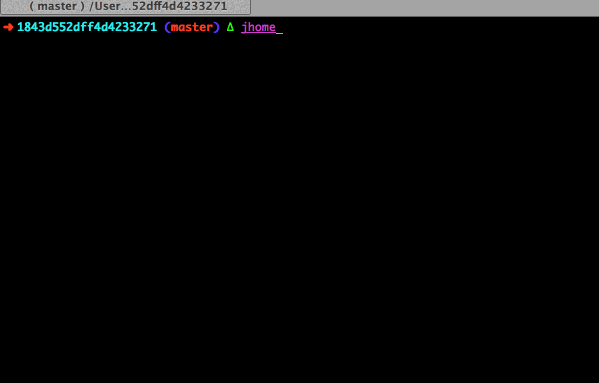

## This little ditty uses sets the java_home based on /usr/libexec/java_home to the local shell.

Usage:
set JAVA_HOME to latest java
~~~
jhome 
~~~
set JAVA_HOME to a certain java version
~~~
jhome -v 1.7
~~~

ref: [kenglxn](https://gist.github.com/kenglxn/1843d552dff4d4233271)

See: [developer.apple.com](https://developer.apple.com/library/mac/documentation/Darwin/Reference/ManPages/man1/java_home.1.html)

